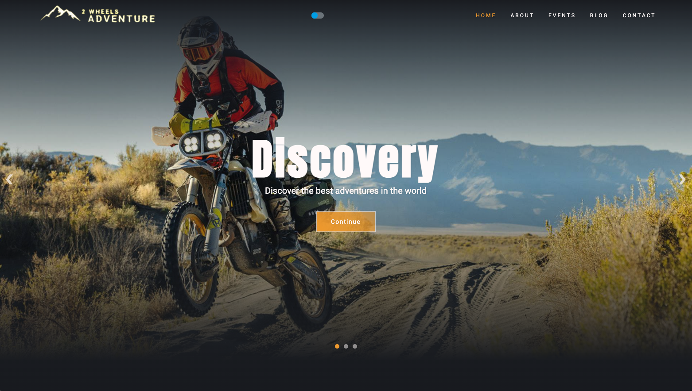

# Frontend Project - 2Wheels Adventure

This is my frontend project for the Full Stack Web development course that I'm taking at [FLAG](https://flag.pt/curso/full-stack-web-developer).

## Table of contents

- [Usage](#usage)
  - [Install Depencencies](#install-dependencies)
  - [Run JSON server](#run-json-server)
  - [Run Vite Frontend](#run-vite-frontend)
- [Overview](#overview)
  - [Context](#context)
  - [The challenge](#the-challenge)
  - [The solution](#the-solution) -[Screenshot](#screenshot)
- [Process](#process) -[Built with](#built-with) -[Technics and Tools](#technics-and-tools)
- [Improvements and Future](#imporvements-and-future)

## Usage

Here are the steps to start this project.
This project uses Vite, React, and a JSON-Server for a mock backend.

Clone or Download this repository to start.

### Install Dependencies

`npm install`

### Run JSON server

The server will run on http://localhost:5000

`npm run server`

### Run Vite Frontend

The App will run on http://localhost:3000

`npm run dev `

## Overview

### Context

Frontend project for my course at [FLAG](https://https://flag.pt/curso/full-stack-web-developer).

Requirements for the project:
- Use of React.
- Use at least 2 hooks.
- Build a CRUD.
- Use an external or dummy API.
- Good HTML semantics and CSS styling.
- Implement a route system.
- A simple form with validation.
- Implementation of a state management is a plus but not mandatory.
  

### The challenge

The client is a company that organize motorcycle events around the globe.
The request is to build a platform where potential users can learn about the company, the team, about the packages available to purchase, the events available to entry, and also to be a platform where the company can publish posts about the previous events and articles about the motorcycle adventure world.
The platform has to be modern and pleasant to the majority of the users.

### The solution

A react multipage application with:

- Homepage: Containing sections about all key topics, as a preview, and with navigation to target topics. Also contains a testimonials section.
  
- About page: Contains the history and description of the company, a carousel with the statistics of the company, and a grid with the team. Each grid item has navigation to a page about the team member.
  
- Events page: Contains an introduction about the events, a section with the packages availables, and a section with the next events. Each event nagitaves to the respective page, where the users can learn more about each event, and with a call to action in the end.

- Blog page: Containes and introduction about the blog as the content, and a section with all the posts. Each post has navigation to target page, where the user can read about the content.

- Contact page: Contain steps on how to entry in a event, and a FAQ section with the most common questions. It also contains a grid with images, acting as a final CTA before the contact form.

- A section in the bottom of each page with a contact form.

- Added features like Dark/Light theme, outlets, sliders, accordions, animations and more to make the platform modern and pleasant to everybody.
  

### Screenhot

## Process

### Built with

- Semantic HTML5 markup
- CSS
- Javascript
- Sass
- React
  

Some Dependencies
- React Icons
- React Spinners
- Framer Motion
- Swiper
- React Hook Form
- React Toastify
- Yup
  

### Technics and tools

Here are some of the technics and tools used in this project

Slider and carousel:
- For this type of challenge, different approaches were used.
  - Stats Carousel: pure CSS.
  - Blog carousel in homepage: Swiper library.
  - Home hero slider: JavaScript and Css.
    

FAQ Accordion:
- Framer Motion library.
  
Weather Report in Event capital
- Use of external OpenWeather API.
  
Blog CRUD:
- Use a dummy API with JSON server to get, add, update, and delete blog posts.
  
Form with validation:
- Use of Hook Form and Yup.
  

"Dropdowns" on click:
- For this challenge, also different approachs were used.
  - Packs "dropdown": useState and UseEffect.
  - Event "dropdown": use of an outlet component to render the Event page.
    

Routes:
- Use of react router dom. Choosen functions:
  - Route
  - createBrowserRouter
  - createRoutesFromElements
  - RouterProvider

Some react hooks were used in the project.
In the majory of cases, from changing images displayed, toggling color themes, to scroll to top on page change, or triggering of transitions, useState and/or useEffect were used.

## Improvements and Future

Improvements:
- Create a State Management either with context API or Redux.
- Create an login routing for admin and user, so only admins can see and acess the CRUD
- Use backend to feed the entire applications
- Add cookies, privacy, packs and events purchase and payment.
- Better and more advanced design, CSS and JavaScript.
  

Future:
- With more 5 to 6 months of classes, this time backend, I intent to use the knowledge obtained in those classes to add these improvements to the application, and make it a finished product to the client.
- With this improvements, and with the implementation of backend requirements, this application will much probably be used in the backend project as well, and after that integrate my portfolio.
